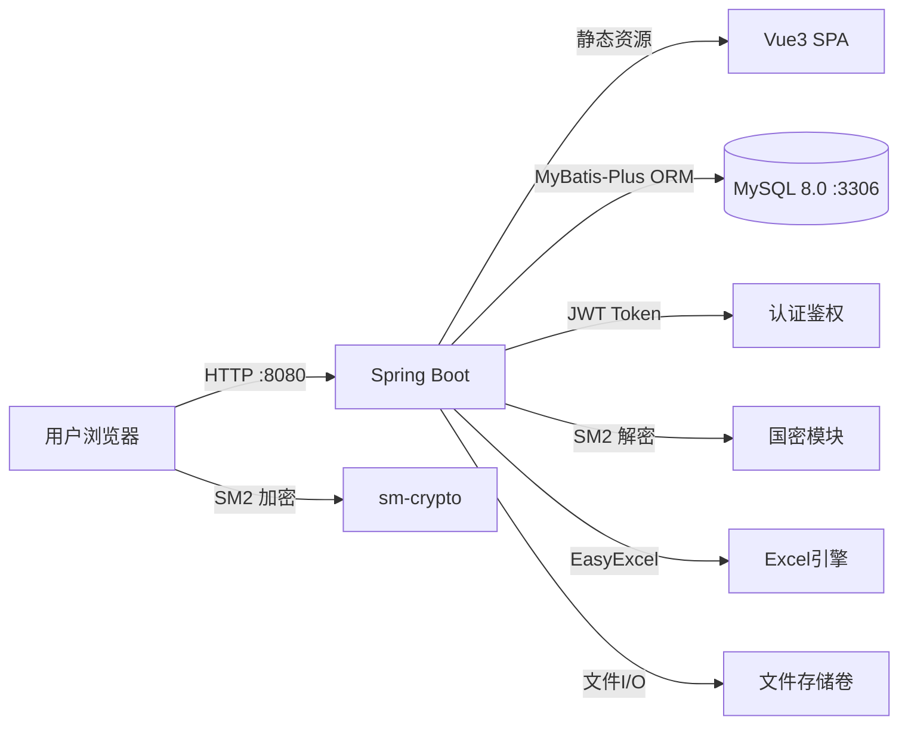
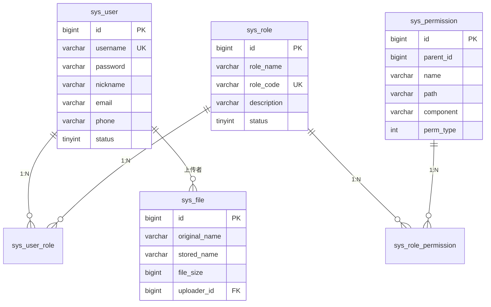

# 🚀 Label Admin — 企业级权限管理系统

> **一站式用户权限管理解决方案**，基于国密SM2加密传输，覆盖用户管理、角色控制、文件管理、Excel数据导入导出等核心业务场景，开箱即用。

---

## 🛠 技术栈

| 层级 | 技术 |
|------|------|
| **Frontend** | Vue 3 + Element Plus + Pinia + Vue Router |
| **Backend** | Spring Boot 3.2.5 + JDK 17 + MyBatis-Plus 3.5.6 |
| **Security** | Spring Security + JWT + 国密 SM2 (BouncyCastle) |
| **Database** | MySQL 8.0 |
| **Excel** | EasyExcel 3.3.4 (Alibaba) |
| **Infra** | 单容器 Docker 启动（前后端统一部署） |

---

## 🚀 快速启动 (Docker)

1. 确保 **Docker Desktop** 已运行
2. 在项目外层执行：
   ```bash
   docker build -t label-admin .
   docker run --rm -p 8080:8080 label-admin
   ```
3. 等待所有服务启动完成（首次构建约 3-5 分钟）
4. 访问应用：http://localhost:8080

## 🔗 服务地址

| 服务 | 地址 |
|------|------|
| **应用（前端+后端）** | http://localhost:8080 |
| **后端 API** | http://localhost:8080/api |
| **MariaDB/MySQL** | 容器内 127.0.0.1:3306 |

## 🧪 测试账号

| 角色 | 用户名 | 密码 |
|------|--------|------|
| 管理员 | admin | 123456 |
| 普通用户 | user1 | 123456 |
| 普通用户 | user2 | 123456 |

---

## 🏗️ 系统架构



### 核心模块职责

| 模块 | 职责 |
|------|------|
| **认证模块** | JWT 无状态认证 + Spring Security 权限拦截 |
| **用户模块** | 用户 CRUD、分页查询、批量导入导出 |
| **角色模块** | RBAC 角色管理、权限树分配 |
| **文件模块** | 文件上传/下载/删除，Docker Volume 持久化 |
| **加密模块** | 国密 SM2 非对称加密，保护敏感数据传输 |
| **个人中心** | 个人信息修改、密码修改，数据实时同步 |

---

## 💾 数据设计



- **数据库**: MySQL 8.0 (UTF-8MB4 字符集)
- **连接池**: HikariCP (Spring Boot 默认)
- **ORM**: MyBatis-Plus 3.5.6

---

## 📷 核心功能

### 1. 用户认证
- 现代化登录/注册界面
- SM2 加密密码传输
- JWT 无状态 Token 认证
- 自动登录状态检测与跳转

### 2. 用户管理 (管理员)
- 用户列表分页查询、条件筛选
- 新增/编辑/删除用户
- 角色分配（单选）
- 管理员防自锁保护（不能禁用自己、不能切换自己角色）

### 3. 角色管理 (管理员)
- 角色 CRUD 操作
- 权限树可视化分配
- 删除前关联数据检查
- 角色列表 Excel 导出

### 4. 文件管理
- 文件上传/下载/删除
- 支持拖拽上传
- 文件大小格式化显示
- 管理员可管理所有文件，普通用户仅管理自己的文件
- 文件列表 Excel 导出

### 5. Excel 导入导出
- 用户列表一键导出为 Excel
- Excel 批量导入用户（自动校验去重）
- 角色列表、文件列表 Excel 导出
- 导入结果统计反馈

### 6. 个人中心
- 基本信息修改（昵称、邮箱、手机号）
- 密码修改（SM2 加密传输）
- 修改后数据全局同步（右上角昵称实时更新）

---

## 📁 项目结构

```
label-admin/
├── README.md                          # 项目文档
├── db/
│   └── init.sql                       # 数据库初始化脚本（含种子数据）
├── backend/                           # Spring Boot 后端
│   ├── settings.xml                   # Maven 阿里云镜像配置
│   ├── pom.xml
│   └── src/main/
│       ├── java/com/label/admin/
│       │   ├── AdminApplication.java  # 启动入口
│       │   ├── annotation/            # 自定义注解 (@OperationLog, @RequiresPermission)
│       │   ├── aspect/                # AOP切面 (操作日志, 权限检查)
│       │   ├── common/                # 统一响应体
│       │   ├── config/                # 配置类 (MyBatis-Plus, WebMvc, Jackson)
│       │   ├── controller/            # REST API 控制器
│       │   ├── dto/                   # 数据传输对象
│       │   ├── entity/                # 数据库实体
│       │   ├── exception/             # 全局异常处理
│       │   ├── filter/                # 安全过滤器 (XSS, 限流, 安全头)
│       │   ├── init/                  # 数据初始化器 (BCrypt密码修复)
│       │   ├── mapper/                # MyBatis-Plus Mapper
│       │   ├── security/              # JWT + Spring Security
│       │   ├── service/               # 业务逻辑层
│       │   └── util/                  # 工具类 (SM2, Excel)
│       └── resources/
│           ├── application.yml        # 应用配置
│           └── mapper/                # MyBatis XML 映射
└── frontend/                          # Vue 3 前端
    ├── package.json
    ├── vite.config.js
    └── src/
        ├── main.js                    # 入口
        ├── App.vue
        ├── api/                       # API 请求封装
        ├── router/                    # 路由 + 守卫
        ├── store/                     # Pinia 状态管理
        ├── utils/                     # 工具 (axios 拦截器, SM2)
        └── views/                     # 页面组件
```

---

## 🔑 关键实现路径

1. **数据库设计** → RBAC 五表模型 (用户-角色-权限) + 操作日志表 + 文件表
2. **安全基座** → Spring Security + JWT + SM2 加密链路
3. **后端 API** → RESTful 接口 + 统一响应体 + 全局异常处理
4. **前端框架** → Vue 3 + Element Plus + 路由守卫 + 权限菜单
5. **业务功能** → 用户/角色 CRUD + Excel 导入导出 + 文件管理
6. **容器化交付** → Docker 统一部署（前后端合一） + 数据持久化

---

## 🔧 专业工程实践

### 1. 日志系统
- 使用 SLF4J + Logback 结构化日志
- 按模块分级输出 (INFO/DEBUG/WARN/ERROR)
- AOP 操作日志 (@OperationLog) 自动记录关键操作
- 通过 `docker compose logs` 可观测

### 2. 错误处理
- `GlobalExceptionHandler` 统一捕获所有异常
- 业务异常 (`BusinessException`) 返回友好提示
- 前端 axios 拦截器消息去重 (2秒 Set + grouping)
- 外键约束/重复数据等数据库异常友好化处理

### 3. 数据校验
- 后端: `@Valid` + `jakarta.validation` 注解校验
- 前端: Element Plus 表单规则 + 自定义校验器
- 邮箱/手机号: 空值允许提交，有值则格式校验

### 4. 接口设计
- RESTful 风格 API
- 统一响应格式: `{code, message, data}`
- 分页接口: `PageResult<T>` 封装
- 权限注解: `@PreAuthorize` 方法级鉴权 + `@RequiresPermission` 按钮级权限

### 5. 安全防护
- XSS 过滤器 (请求参数/头部清洗)
- 登录限流过滤器 (同IP 5分钟内限制失败次数)
- 安全响应头 (X-Frame-Options, X-Content-Type-Options 等)
- SM2 私钥通过环境变量注入，不硬编码

### 6. 生产级特性清单

| 特性 | 状态 | 说明 |
|------|------|------|
| 容器化部署 | ✅ | Docker Compose 统一部署（前后端合一） |
| 数据持久化 | ✅ | Docker Volume 持久化 DB + 文件 |
| RBAC 权限 | ✅ | 用户-角色-权限三级控制 |
| 按钮级权限 | ✅ | @RequiresPermission AOP 细粒度控制 |
| 操作日志 | ✅ | @OperationLog AOP 自动记录 |
| SM2 加密 | ✅ | 国密非对称加密传输 |
| JWT 认证 | ✅ | 无状态 Token 认证 |
| XSS 防护 | ✅ | 请求参数过滤 |
| 登录限流 | ✅ | 防暴力破解 |
| 数据初始化 | ✅ | 启动自动 Seed + BCrypt 密码修复 |
| UTF-8 中文 | ✅ | 全链路 UTF-8MB4 |
| 多数据库支持 | ✅ | 动态检测 MySQL/PostgreSQL/Oracle 等 |
| Excel 导入导出 | ✅ | EasyExcel 用户/角色/文件列表 |
| 响应式布局 | ✅ | PC + 移动端适配 |
| 模块化架构 | ✅ | 清晰的分层与职责划分 |
| 错误处理 | ✅ | 统一异常 + 消息去重 |

---

## 🐳 Docker 配置说明

### 镜像加速
- **Maven**: 阿里云镜像 (`settings.xml`)
- **npm**: 淘宝镜像 (`registry.npmmirror.com`)
- **前端构建**: `npm ci` 确定性安装

### 多阶段构建（统一镜像）
- **阶段1 前端构建**: `node:20-slim` → 生成静态资源
- **阶段2 后端构建**: `maven:3.9-eclipse-temurin-17` → 前端dist嵌入后端static目录，打包为JAR
- **阶段3 运行**: `eclipse-temurin:17-jre` → 单一JAR提供前后端服务

### 数据库健康检查
- MySQL 配置 `healthcheck` + `start_period: 30s`
- 应用通过 `depends_on: condition: service_healthy` 确保数据库就绪
